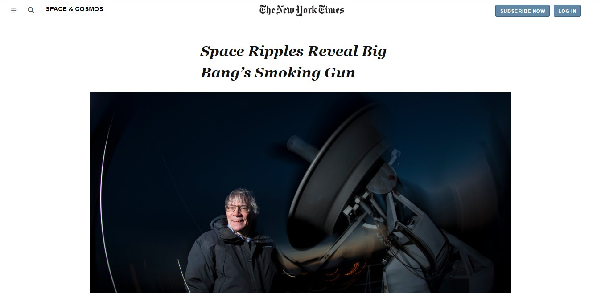

# Project Name
New York Times Article Clone Page

## Table of contents
* [General info](#general-info)
* [Screenshots](#screenshots)
* [Technologies](#technologies)
* [Setup](#setup)
* [Features](#features)
* [Status](#status)
* [Inspiration](#inspiration)
* [Contact](#contact)

## General info
The purpose of this project is to make a clone of a <a href="https://www.nytimes.com/2014/03/18/science/space/detection-of-waves-in-space-buttresses-landmark-theory-of-big-bang.html?_r=0" target="_blank" >New York Times article page</a>. It is a collaborative effort by <a href="https://github.com/adaorachi" target="_blank">MaryAnn Chukwuka</a> and <a href="https://github.com/JayKowski" target="_blank"> Judah Maina </a>.

## Screenshots

View other screenshots:
<a href="images/screenshot2.jpg">Screenshot 1</a>
<a href="images/screenshot3.jpg">Screenshot 2</a>
<a href="images/screenshot4.jpg">Screenshot 3</a>

## Technologies
* HTML5
* CSS3

## Setup
This project is built with the basic web page structures and styling. It is pretty simple to setup. All you have to do is to clone the project into your local repository. 
Find attatched below a preview of the project:  
<a href="https://raw.githack.com/JayKowski/new-york-times/developer/index.html">New York Times Article page </a>

## Features
List of features ready and TODOs for future development
* We do not have any future or TODO developement for now. We will definitely give out a notice should we decide to.

## Status
The project is currently finished.

## Inspiration
The inspiration for this project was gotten from <a href="https://www.nytimes.com/2014/03/18/science/space/detection-of-waves-in-space-buttresses-landmark-theory-of-big-bang.html?_r=0" target="_blank" >New York Times Article page</a>. This project was really fun to build and at the same time quite challenging. In this project, there were quite a handful of aligned and positioned elements on the web page, and so our aim is to achieve them using the css float property only. 

## Contact
Created by [@MaryAnn Chukwuka](https://github.com/adaorachi) and [@Judah Maina](https://github.com/JayKowski) - feel free to contact us!

